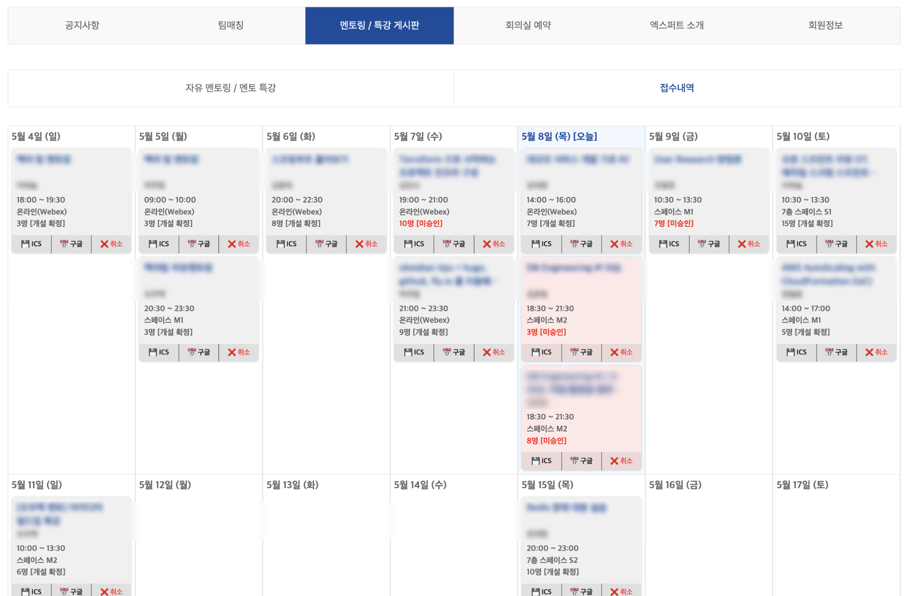

# 소마 멘토링 시간표 (Soma Calendar)

<a href="https://chromewebstore.google.com/detail/nlemmjbkihccbkdaihfgijnepogepoob" target="_blank" title="Get Soma Calendar from Chrome Web Store"></a>
<a href="https://addons.mozilla.org/firefox/addon/soma-calendar/" target="_blank" title="Get Soma Calendar from Firefox Add-ons"></a>

[](https://chrome.google.com/webstore/detail/nlemmjbkihccbkdaihfgijnepogepoob)
[](https://addons.mozilla.org/firefox/addon/soma-calendar/)
[](https://github.com/ymjoo12/soma-calendar/releases)

연수생이 접수한 멘토링/특강 내역을 접수 내역 페이지에서 시간표 형태로 확인할 수 있는 브라우저 확장 프로그램입니다.

(연수생분들의 기능 추가/수정 PR을 환영합니다 😀)




## 📖 주요 기능

1. **접수 내역 페이지**

- 접수 내역을 달력 형태로 표시합니다. (금주 포함 4주, 오늘 날짜 하이라이팅, 지난 항목 회색 표시)
- 접수 내역을 날짜별로 제목, 멘토명, 시간, 장소, 인원수, 개설 확정 여부 순으로 표시합니다.
- 시간이 겹치는 내역은 **붉은색 배경**으로 표시되어 한눈에 확인할 수 있습니다.
- 접수 내역을 클릭하면 해당 페이지로 이동합니다.
- 접수 내역을 **ICS 파일**로 다운로드할 수 있습니다. (외부 캘린더 추가 가능)
- 접수 내역을 **구글 캘린더**에 추가할 수 있습니다. (구글 로그인 필요)
- 접수 내역을 캘린더에서 취소할 수 있습니다.

2. **멘토링/특강 목록 페이지**

- 달력에서 각 항목 상세 팝업에 시간/장소/인원 정보를 표시합니다.
- 목록에서 이미 접수한 내역과 시간이 겹치는 항목은 붉은색으로 표시합니다.
- 목록에서 이미 접수한 내역과 시간이 겹치는 항목이 무엇인지 마우스 오버시 팝업으로 표시합니다.

3. **멘토링/특강 상세 페이지**

- 이미 접수한 내역과 시간이 겹치는 항목일 경우 경고를 표시합니다.

4. **확장 프로그램 팝업**

- 소마 홈페이지, 멘토링/특강 접수 내역 페이지로 이동할 수 있는 버튼을 제공합니다.
- 확장 프로그램의 버전 정보를 표시합니다.
- 문의(GitHub), 웹 스토어(Chrome, Firefox) 링크를 제공합니다.


## 🧩 지원 브라우저 (스토어 설치)

- **Chrome** (호환 브라우저 포함): [Chrome Web Store](https://chromewebstore.google.com/detail/nlemmjbkihccbkdaihfgijnepogepoob)
- **Firefox**: [Firefox Add-ons](https://addons.mozilla.org/firefox/addon/soma-calendar)


## 📦 수동 설치 방법

1. [Releases](https://github.com/ymjoo12/soma-calendar/releases) 페이지에서 최신 버전의 zip 파일을 다운로드합니다.
2. 압축을 해제합니다.
3. 브라우저에 맞는 방법으로 확장 프로그램을 로드합니다.
4. `soma-calendar` 폴더(압축해제된 폴더)를 선택합니다.

### 🔧 Chrome

1. 주소창에 `chrome://extensions` 입력
2. "개발자 모드 (Developer mode)" 설정 (스토어에 없는 확장 프로그램을 설치하기 위해 필요합니다.)
3. "압축해제된 확장 프로그램 로드 (Load unpacked)" 클릭
4. `soma-calendar` 폴더(압축해제된 폴더)를 선택합니다.

### 🔧 Firefox

1. 주소창에 `about:debugging#/runtime/this-firefox` 입력
2. "임시 부가 기능 로드..." 클릭
3. `soma-calendar` 폴더(압축해제된 폴더) 혹은 폴더 내 `manifest.json` 파일을 선택합니다.

### 🔧 개발 버전 설치

```bash
git clone https://github.com/ymjoo12/soma-calendar.git
```
- git pull을 통해 최신 버전으로 업데이트 가능합니다.


## 🙌 Contributors

| 기여자 | 기여 내용 | 관련 PR |
|---|---|----|
| [@ymjoo12](https://github.com/ymjoo12) | 초기 버전 개발 및 유지보수 | – |
| [@younghun1124](https://github.com/younghun1124) | 도메인 이슈 해결 | [#2](https://github.com/ymjoo12/soma-calendar/pull/2) |
| [@alsgud8311](https://github.com/alsgud8311) | ICS 파일 생성 기능 | [#3](https://github.com/ymjoo12/soma-calendar/pull/3) |
| [@skymygo](https://github.com/skymygo) | 멘토링 일정 중복 경고 / 버그 수정 | [#4](https://github.com/ymjoo12/soma-calendar/pull/4), [#8](https://github.com/ymjoo12/soma-calendar/pull/8), [#17](https://github.com/ymjoo12/soma-calendar/pull/17), [#20](https://github.com/ymjoo12/soma-calendar/pull/20) |
| [@SioJeong](https://github.com/SioJeong) | UI 개선 | [#5](https://github.com/ymjoo12/soma-calendar/pull/5) |
| [@3ae3ae](https://github.com/3ae3ae) | Firefox 지원 | [#6](https://github.com/ymjoo12/soma-calendar/pull/6) |
| [@jang-namu](https://github.com/jang-namu) | 멘토링 일정 중복 시 마우스 오버 팝업 | [#10](https://github.com/ymjoo12/soma-calendar/pull/10) |
| [@qyinm](https://github.com/qyinm) | 구글 캘린더 추가 기능 | [#22](https://github.com/ymjoo12/soma-calendar/pull/22) |
| [@softwareDefine](https://github.com/softwareDefine) | 도메인 변경 및 레이아웃 변경 반영 | [#27](https://github.com/ymjoo12/soma-calendar/pull/27), [#29](https://github.com/ymjoo12/soma-calendar/pull/29) |
| [@lickelon](https://github.com/lickelon) | 멘토링 달력 팝업 정보 개선, 취소 버튼 기능 수정 | [#30](https://github.com/ymjoo12/soma-calendar/pull/30), [#36](https://github.com/ymjoo12/soma-calendar/pull/36) |
| [@doorcs](https://github.com/doorcs) | 지나간 강의 회색 표시, 코드 포매팅, 레이아웃 변경 fallback 추가 | [#32](https://github.com/ymjoo12/soma-calendar/pull/32), [#33](https://github.com/ymjoo12/soma-calendar/pull/33) |
